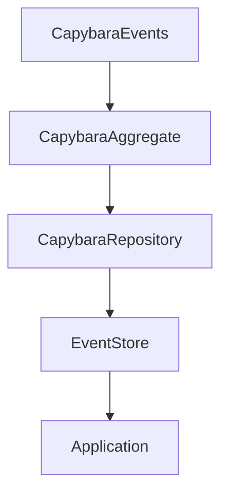

# Capybara Event Sourcing Demo

## Purpose

This demo showcases an event-sourcing implementation using a fictional story about a capybara. 
The purpose is to illustrate how event sourcing can be used to track changes over time in a system.

## The Capybara Story

In this demo, we follow the journey of a capybara named Capy. 
Capy goes through various events such as eating, sleeping, and exploring. 
Each event is recorded and can be replayed to understand Capy's activities over time.

### Code Illustration

The main sections of the code that illustrate the capybara story are:
- `Events/CapybaraEvents.cs`: Defines the events related to Capy's activities.
- `Aggregates/CapybaraAggregate.cs`: Manages the state of Capy based on the events.
- `Repositories/CapybaraRepository.cs`: Handles the storage and retrieval of Capy's events.

## Component Organization



## Running the Application

To run the application, follow these steps:

1. Clone the repository:
    ```sh
    git clone https://github.com/yourusername/CapybaraEventSourcing.git
    cd CapybaraEventSourcing
    ```

2. Build the application:
    ```sh
    dotnet build
    ```

3. Run the application:
    ```sh
    dotnet run
    ```
